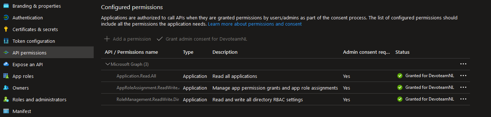

# Resource group provisioner (RGP)

Here you can find:

- The bicep files to provisioning the RGP
- The powershell script to assign the roles to the RGP identity. Those permissions are necessary to invite new users and provision the resource group
- The [src](src) folder: where are the azure function files. For more check read the [readme.md](src/ResourceGroupProvisionerFunction/readme.md)

## Script adRoleAssignmentToFunction.ps1

API permission needed to run `adRoleAssignmentToFunction.ps1` in a pipeline:

- Application.Read.All
- AppRoleAssignment.ReadWrite.All 
- RoleManagement.ReadWrite.Directory  

[]
