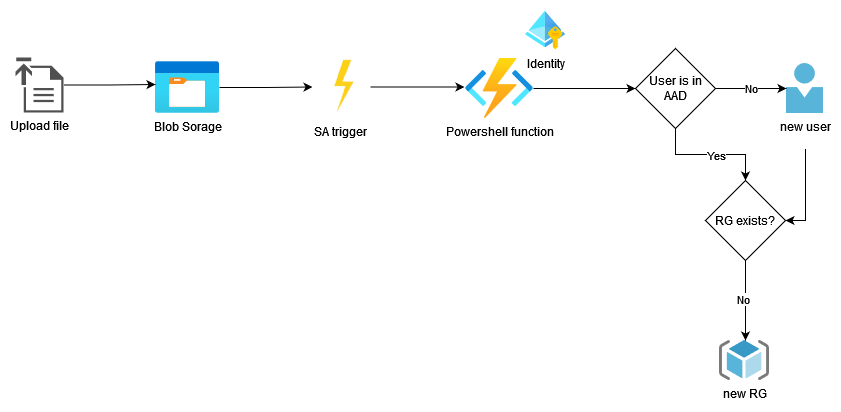

# BlobTrigger - PowerShell

The `BlobTrigger` makes it incredibly easy to react to new Blobs inside of [Azure Blob Storage](https://azure.microsoft.com/en-us/services/storage/blobs/).

## How it works

For a `BlobTrigger` to work, you provide a path which dictates where the blobs are located inside your container, and can also help restrict the types of blobs you wish to return. For instance, you can set the path to `samples/{name}.json` to restrict the trigger to only the samples path and only blobs with ".json" at the end of their name. Check the property `bindings[0].path` at [function.json](function.json)

# Resource group provisioner

This function is responsible for creating and configuring a resource group after someone request for a Playground.

When the storage account triggers the [run.ps1](run.ps1) file is executed. 

## Diagram

[]
