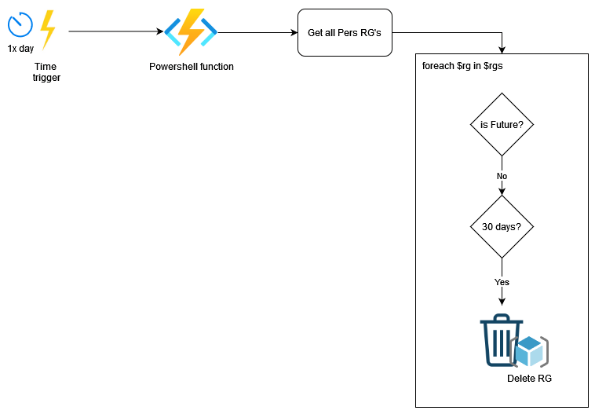

# TimerTrigger - PowerShell

The `TimerTrigger` makes it incredibly easy to have your functions executed on a schedule. This sample demonstrates a simple use case of calling your function every 5 minutes.

## How it works

For a `TimerTrigger` to work, you provide a schedule in the form of a [cron expression](https://en.wikipedia.org/wiki/Cron#CRON_expression)(See the link for full details). A cron expression is a string with 6 separate expressions which represent a given schedule via patterns. The pattern we use to represent 00:00 of each day is `0 0 0 * * *`.

## Diagram

